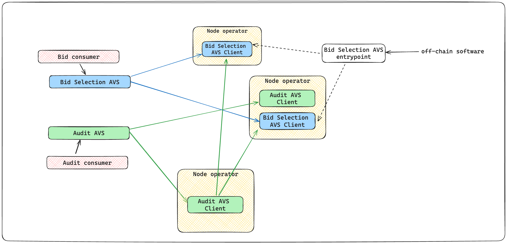

# Smart Contract Auditor AVS

## Project Overview

This AVS is designed to facilitate secure, efficient, and transparent smart contract auditing using Zero-Knowledge Proofs (ZKPs) for bid submissions and verifications. This README provides an overview of the AVS design, outlines the roles of AVS clients, operators, aggregators and auditors, the phases of development, and the use of ZKPs to ensure a secure and fair auditing process.

The AVS aims to enhance the quality of smart contract audits by:

1. ensuring a decentralized process of verifying and selecting the best auditors.
2. enabling auditors to stake their own assets as a guarantee for their audit reports, earning better rewards.

## Key Actors

- **AVS Clients:** Individuals or entities who request audits for their smart contracts.
- **Auditors:** Professionals who specialize in smart contract security and bid on audit requests. They provide comprehensive audit reports upon completion of the audit. Auditors may or may not be node operators. However, all auditors interact with the AVS as operators or clients, submitting zero-knowledge proofs for their bids and credentials.
- **ZKP Reviewers:** Experts in Zero-Knowledge Proofs who verify the validity of the ZKPs submitted by auditors, ensuring that the bidding process is fair and transparent.

## Main Functions of the AVS

- **Request Management:** Handles the creation, tracking, and management of audit requests, including bid deadlines, criteria, and ZKP reviewer selection.
- **ZKP Verification Coordination:** Facilitates the secure distribution of ZKPs to reviewers, collects their verification results, and determines consensus based on the predefined threshold.
- **Bid Selection:** Evaluates valid bids and selects the winning auditor based on specified criteria.
- **Escrow and Payment:** Manages the secure escrow of funds and their disbursement upon successful audit completion.
- **Report Verification:** Assesses the quality and adherence of audit reports to the initial criteria.
- **Reputation Management (Optional):** Maintains a reputation system for both auditors and ZKP reviewers, tracking their performance and reliability over time.
- **Dispute Resolution (Optional):** Provides a mechanism to resolve disputes that may arise between users, auditors, or ZKP reviewers regarding audit quality, ZKP validity, or payment issues.

## Structural Flow of the AVS

## Request Creation

Using the `AuditRequestManager`, a user initiates an audit request by providing the following details:

- smart contract repository link,
- budget in USDC,
- bid deadline,
- audit criteria,
- desired number of ZKP reviewers, and
- the consensus threshold for ZKP verification.

## Auditor Bidding

Auditors assess the audit request and submit their bids in a Zero-Knowledge (ZK) manner. Each bid includes:

- **Zero-Knowledge Proof (ZKP) Bid Amount:** A cryptographic proof demonstrating that the auditor's bid meets the budget without revealing the actual bid amount.
- **Zero-Knowledge Proof (ZKP) Credentiuals:** A cryptographic proof demonstrating that the auditor's qualifications meet the specified criteria without revealing the specific details of their qualifications.

## ZKP Reviewer Selection

The AVS randomly selects (or selects based on reputation) a predetermined number of ZKP Reviewers from the registered pool.

The AVS **Operator Registration:** maintains a registry of operators who have opted into the AVS system, differentiating between two types:

- **Auditors:** Perform the actual smart contract audits.
- **ZKP Reviewers:** Specialize in verifying the ZKPs submitted by auditors.

The following features have also been planned for the next stage,

- **Reputation Tracking:** Tracks the reputation or performance metrics (e.g., successful audits, timely submissions, accurate ZKP verifications) of both types of operators, potentially using a separate ReputationManager contract.
- **Stake Management:** May require operators to stake a certain amount of tokens upon registration as a form of commitment and to incentivize honest behavior.

## ZKP Verification & Vote

The selected ZKP Reviewers independently verify the ZKPs submitted by the auditors. They assess whether the proofs are valid and satisfy the audit criteria without revealing the bid amount. Each reviewer submits their verification result (pass/fail) to the AVS.

This voting mechanism could be an off-chain mechanism in the future. Currently, this is implemented as a random selection, post Zkp validation.

## Consensus and Bid Selection

The AVS aggregates the verification results from the ZKP Reviewers. If a bid's ZKP receives sufficient passing verifications (based on the predefined consensus threshold), it is considered valid. The AVS then selects the winning bid based the maximum number of votes as submitted by the ZKP reviewers.

## Funds Escrow [Phase 2]

Upon bid selection, the user's USDC payment is securely held in escrow within the AVS smart contract.

## Audit Execution [Phase 2]

The winning auditor conducts a comprehensive audit of the smart contract, adhering to the specified criteria and industry best practices.

## Report Submission [Phase 2]

After completing the audit, the auditor submits a detailed report to the AVS, outlining their findings, identified vulnerabilities, and recommendations.

## Report Verification [Phase 2]

The AVS assesses the audit report, ensuring its quality, thoroughness, and adherence to the initial audit request criteria.

- **Report Assessment:** Checks the audit report submitted by the winning auditor against the initial audit request criteria.
- **Additional Checks:** May perform further analysis, such as automated code checks or manual review, depending on the complexity and requirements of the audit.
- **Success Determination:** Evaluates the audit report and additional checks to determine if the audit was successful, triggering payment release from escrow if so.

## Payment and Funds Release [Phase 2]

If the audit report is deemed satisfactory, the escrowed funds are released to the winning auditor. Any remaining funds are returned to the user.

- **ReputationManager:** (If applicable) Tracks and manages the reputation of both auditors and ZKP reviewers, incorporating various performance metrics.
- **DisputeResolution:** (If applicable) Provides a mechanism for resolving disputes between users, auditors, and ZKP reviewers regarding audit results, ZKP validity, or payment issues.

## Slashing [Phase 3]

If the report is challenged by proving a hack or vulnerability, before the time-frame of the audit report guarantee has elapsed, the auditing node is slashed.

## Phased Development

### Phase 1 (current)

- **Add Bids and Request Together**: In this phase, the bid submission process is integrated with the initial audit request.
- **Only ZKP for Bid Value Verification**: Zero-Knowledge Proofs are used solely for verifying the bid values without revealing them.
- **Random Selection**: Auditors and ZKP Reviewers are selected randomly from the pool of available participants.
  Frequency-Based Aggregation: Aggregation of results is based on the frequency of verified values.

## Phase 2

- **Separation of Bids and Request**: The bid submission process is decoupled from the initial audit request, allowing for more flexibility and better management.
- **Allow node operators to be bidders and add stake**: Node operators can participate as bidders and stake their assets, increasing their potential rewards for successful audits.
- **Off-Chain Selection**: The selection process for auditors and ZKP Reviewers is moved off-chain to improve efficiency and scalability.

## Phase 3

- **Audit Execution and Verification**: This phase focuses on the comprehensive execution of the audit and verification of the audit reports, ensuring thoroughness and adherence to the specified criteria.

## ZKP Implementation for Operator Bidding

[A proof-of-concept zk module](./operator/zkp) was implemented usign `gnark` to verify that the bids submitted in response to an audit request are in accordance with the threshold in the request.

The goal of using zero knowledge proofs is to allow auditors to submit bids privately, proving they meet the audit criteria without revealing their actual bid amount. This is achieved through the use of Zero-Knowledge Proofs (ZKPs) and the involvement of ZKP Reviewers.

The zero knowledge proof interactions, across the various workflow steps are described below -

**1. Circuit Design:**

This circuit encapsulates the logic for verifying an auditor's qualifications and bid without disclosing the bid amount itself.

- **Private Inputs:**
  - **Auditor's Bid:** The actual USDC amount the auditor is bidding.
  - **Auditor's Credentials:** Evidence demonstrating the auditor's experience, qualifications, past audits, etc. (The exact format depends on the chosen criteria).
- **Public Inputs:**
  - **Minimum Criteria Hash:** A hash of the minimum qualifications required for the specific audit request.

**2. Proof Generation:**

- The auditor generates a ZKP using the designed circuit and their private inputs. This proof cryptographically attests that:
  - The auditor's bid meets or exceeds the minimum criteria.
  - The auditor's credentials are valid (without revealing the specifics).

**3. Bid Submission:**

- The auditor submits the following to the AuditRequestManager contract:
  - **Encrypted Bid:** The bid amount, encrypted using a secure method like RSA or Elliptic Curve Cryptography, is sent along with the ZKP to the AuditRequestManager contract..
  - **Zero-Knowledge Proof:** The proof generated in step 2.

**4. ZKP Distribution and Verification:**

- The AuditRequestManager contract selects a predetermined number of ZKP Reviewers.
- The BidVerifier contract securely distributes the auditor's ZKP to the selected ZKP Reviewers.
- Each ZKP Reviewer independently verifies the ZKP against the public inputs (minimum criteria hash) to confirm its validity without revealing the bid amount.
- Reviewers submit their verification results (pass/fail) to the AuditRequestManager.

**5. Consensus and Bid Selection:**

- The AuditRequestManager contract aggregates the verification results from the ZKP Reviewers.
- If the ZKP receives sufficient passing verifications based on the predefined consensus threshold, the bid is considered valid.
- Valid bids proceed to the bid selection stage, where the winning auditor is chosen based on predefined criteria (lowest valid bid, reputation, or a combination).

## Benefits of Using ZKPs with Reviewers

- **Enhanced Privacy:** Maintains the confidentiality of bid amounts, preventing potential collusion or undercutting among auditors.
- **Decentralized Verification:** Distributes the responsibility of ZKP verification across multiple parties, reducing the reliance on a single entity and enhancing trust in the system.
- **Specialized Expertise:** Allows for the involvement of ZKP experts who can rigorously assess the validity of the proofs.
- **Fairness and Transparency:** Ensures bids are evaluated solely on merit (qualifications) and promotes transparency in the selection process.

## Challenges and Considerations

- **Complexity:** Designing and implementing ZKP circuits and coordinating the verification process across multiple reviewers can be complex.
- **Performance:** ZKP generation and verification can be computationally intensive, requiring optimizations for scalability.
- **Incentive Alignment:** Ensuring that ZKP Reviewers are incentivized to participate honestly and accurately is crucial. This could involve rewards (tokens, reputation) or penalties for incorrect verifications.

